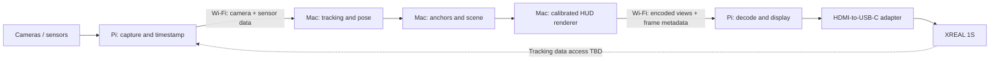

# Architecture plan

Status: proposed. The requested topology, XREAL 1S, existing HDMI-to-USB-C
adapter, and world-anchored graphics are confirmed. Implementation choices below
remain open until hardware experiments provide evidence.

The [stack recommendation](stack.md) supplies concrete candidates for those
experiments; their end-to-end compatibility has not yet been tested.

## Intended result

A graphic stays registered to a physical location as the wearer rotates and
translates their head. The first proposed demonstration is one label attached
to a visible physical marker. Persistence across sessions and markerless mapping
can follow after this works.

## Runtime boundaries



Both Pi boxes run on the same Pi 5. Both directions share the Wi-Fi link and
must be benchmarked together. The [repository plan](repository-plan.md) proposes
four projects: capture and display on the Pi, compute and HUD on the Mac.
Their process arrangement remains open. Keep schemas and conventions in
`packages/protocol`.

The Mac owns world state and rendering. The Pi owns hardware access, timely
capture, stream reception, and presentation. Any display-side correction must
be evaluated explicitly; it is not already supplied by this architecture.

## World tracking

Choose between two evidence-driven paths:

| Path | What must be proven |
| --- | --- |
| Glasses-provided pose | The exact glasses/accessories expose usable position/orientation through a supported runtime and the actual connection. |
| External tracking | A rigidly mounted camera can estimate a known marker's pose; camera-to-eye calibration yields accurate overlay alignment. Add IMU fusion or markerless tracking later as needed. |

Native 3DoF screen anchoring does not measure head translation. A 6DoF screen
mode also does not by itself expose the world coordinates needed by our app.
See [hardware evidence](../hardware/README.md). Begin by proving data access;
do not select a renderer on an assumption that a glasses SDK runs on the Pi.

Track pose validity and uncertainty. Hide invalid world overlays when tracking
is lost. Define recovery and world-origin changes so a reconnect cannot reuse
anchors from the wrong coordinate frame.

## Rendering and calibration

Render from the estimated eye poses, using measured camera/IMU/head/eye
transforms and calibrated projection. Confirm whether the output path permits
separate left/right images and how they are packed.

Define who applies head-motion compensation: the application, the glasses, or
a verified combination. Uncoordinated compensation by both can move an overlay
twice. Test the selected display mode with a physical alignment target.

Treat optical overlay rendering and camera preview as separate outputs. The
world-alignment acceptance test must be viewed through the glasses; a correct
overlay on a Mac camera preview alone is insufficient.

## Timing and transport

Use separate logical paths for media, current sensor/pose data, and reliable
control. Decide on the actual transport and codecs after short hardware
experiments. Keep queues bounded and prefer current frames over a backlog.

Measure the full path:

```text
capture -> uplink encode -> Wi-Fi -> decode/tracking -> scene/render
        -> downlink encode -> Wi-Fi -> Pi decode -> display scanout
```

Record frame IDs, capture/render/presentation times, pose age, queue depth,
dropped frames, bitrate, and thermal behavior. Estimate clock offset and drift
before comparing timestamps from different computers. Socket round-trip time
does not measure motion-to-photon latency; include an optical measurement.

Remote rendering introduces pose age. Evaluate prediction for intended display
time and, if a current local pose is available, display-side reprojection.
Rotational correction alone cannot fully repair translation or reveal missing
image content. If anchoring fails under motion, revisit rendering placement,
depth/geometry delivery, or the display runtime before adding product features.
Keep the requested Mac-rendered loop as the baseline to test.

Use explicit peer configuration for the first bench prototype. Select peer
authentication and transport protection with the production transport.

## Decisions still needed

| Decision | Evidence / input needed |
| --- | --- |
| Tracking source | Eye availability, USB data access, external camera/IMU selection. |
| Graphics meaning | First physical target, desired depth, allowable drift, behavior when target leaves view. |
| Display mode | Tested adapter modes, stereo access, control of built-in anchoring. |
| Mac stack | Mac chip, pose API compatibility, render/encode experiment. |
| Pi stack | OS, capture APIs, codec availability, simultaneous-load experiment. |
| Media and telemetry transport | Measured latency, loss recovery, and implementation support. |
| Performance targets | Agreed frame rate, p95 motion-to-photon latency, alignment error, recovery time. |
| Network | Shared AP versus hotspot, expected range and interference. |

The repo structure is independent of these decisions. Add language manifests,
task runners, CI, and deployment tooling when runnable components exist.
