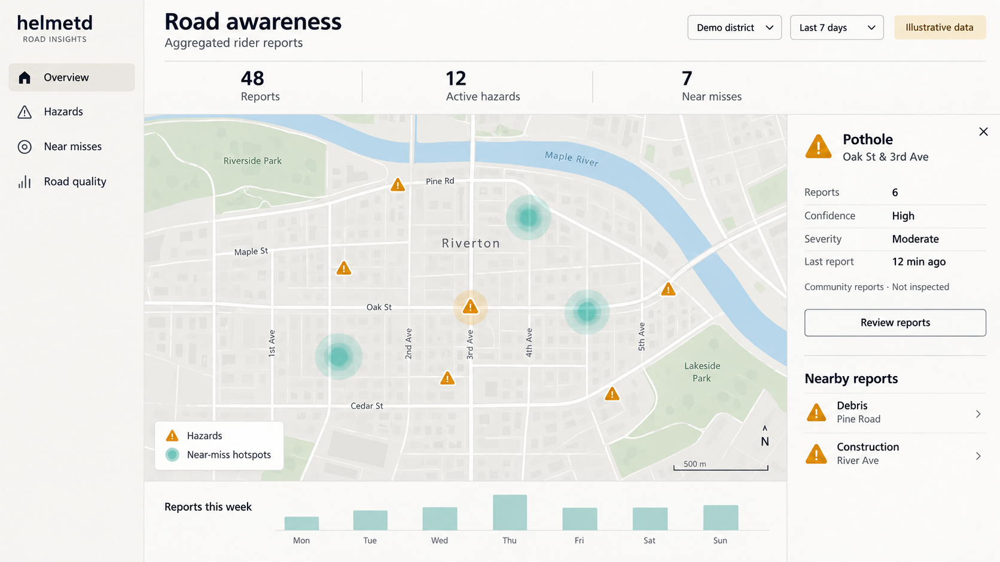

# Civic road-awareness dashboard concept

A separate desktop/web concept for the user's civic dashboard feature. It shows
aggregate hazard markers and near-miss hotspots, a selected report with count,
confidence, severity and recency, nearby reports, and a weekly reporting trend.

The map, street names, counts, confidence labels, and time values are illustrative.
There is no live civic dataset or implemented dashboard behind this image.
Individual riders and their movement histories are not shown.

Proposed interface responsibilities:

- Filter the geographic area, time window, report type, and report status.
- Separate community reports from inspected or otherwise verified records.
- Keep duplicate merging, confidence calculation, expiry, and severity definitions
  explicit in the data model; the mockup does not establish those algorithms.
- Link aggregate hotspots to supporting anonymized events rather than expose
  identifiable rider traces.
- Distinguish unresolved reports, resolved hazards, and insufficient evidence.

This view is intended for the Mac or a browser, outside the riding HUD. Creating
a runnable web app and connecting storage/report APIs remain future work.

Generated with built-in imagegen. The exact prompt is in
[feature-concepts-prompts.json](../feature-concepts-prompts.json).
See the [HUD states](../hud/extended-states.md) for the rider-facing concepts.
