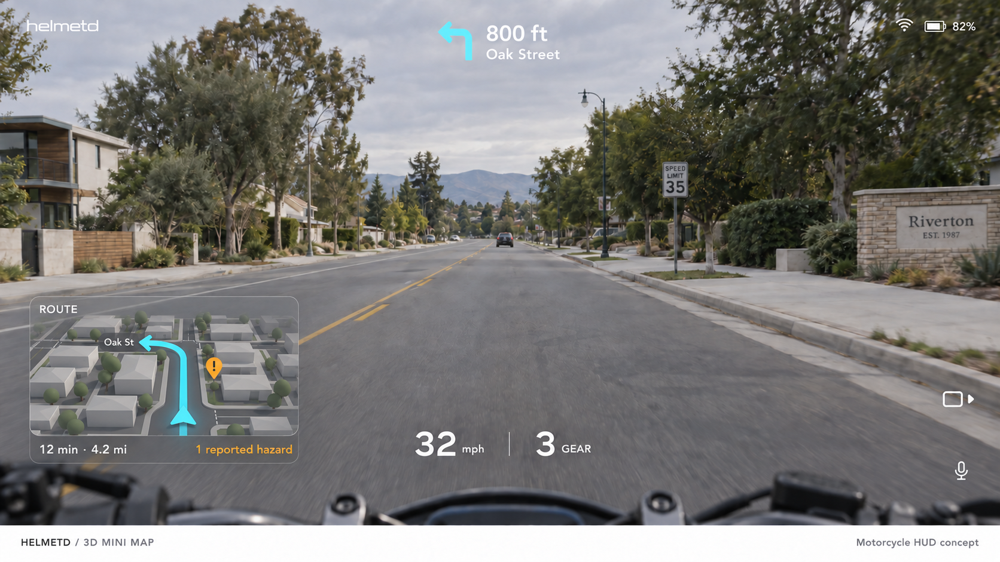
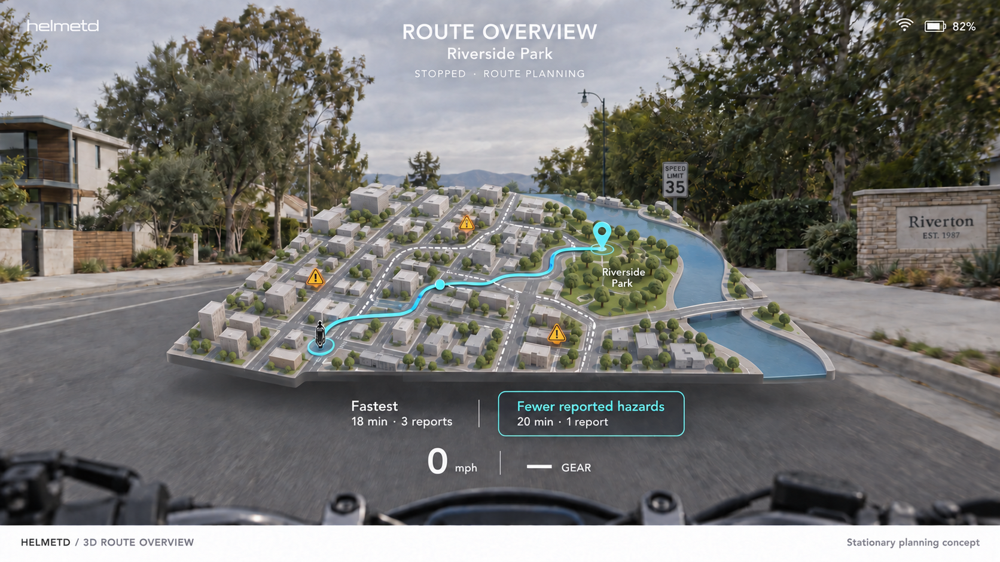

# 3D navigation map concepts

Two additional directions for the motorcycle HUD, generated with built-in imagegen.
These PNGs are visual concepts, not interactive maps, 3D model assets, or a working
routing service. Streets, buildings, routes, timings, and reports are illustrative.

## Compact map

A small perspective map shows nearby street geometry, the selected route, current
position, trip time/distance, and a reported hazard. The next-turn arrow remains
the primary navigation cue; the miniature map is optional supporting context.
Buildings are simplified and labels sparse so the route is the clearest element.

Proposed behavior:

- Collapse the map when a camera inset or higher-priority alert needs its space.
- Keep the forward road and fixed speed/gear readouts free of map content.
- Use a consistent heading-up orientation; handle stationary/uncertain heading
  explicitly instead of letting the map spin with noisy inputs.
- Adapt map extent near a maneuver with a stable transition rather than abrupt zooms.
- Distinguish reported hazards and group location markers from camera detections.
- Show unavailable or stale location explicitly; preserve the distinction between
  a cached map and a current position fix.

## Expanded route overview

A stationary planning view expands the geometry, destination, route alternatives,
reported hazards, and a group-position dot. Route choices compare estimated travel
time and known report counts. Fewer reports is not a promise of greater safety;
coverage, freshness, and confidence must be part of the eventual comparison.

This is a proposed stopped-only mode, entered through an explicit command/control.
Movement or unavailable movement state should collapse it back to ordinary HUD
navigation. The concept shows route-selection styling, not touch input through
the glasses. Voice and physical control mappings remain implementation work.

## Relationship to world anchoring

The map contains 3D geometry inside a fixed HUD element. It can be prototyped as
ordinary rendered HUD content without claiming that its streets line up with the
physical road. World-anchored road arrows remain a separate goal requiring the
calibrated pose/projection pipeline described in the main roadmap.

## First implementation slice

The native C++/Metal HUD now provides the base render/encode path. Prove it on
the Pi and glasses before adding the map. MapLibre Native is a candidate for
the eventual map integration; this document does not commit to its offscreen
texture interoperability or a routing provider.

1. Add a small synthetic street mesh and route line to the HUD simulator.
2. Drive a position marker along a recorded or simulated route; exercise heading,
   turn transitions, lost location, and alert-driven collapse.
3. Add the expanded stationary view using the same route/scene data.
4. Choose and verify map/routing data sources, usage terms, caching, geographic
   coordinates, and renderer integration before replacing the synthetic scene.
5. Check apparent size, label readability, overlap, and render cost through the
   actual glasses; the full-scene artwork is not a calibrated display specification.

Possible later layers include group markers, route progress, elevation/curve
preview, and time-filtered hazard reports. They should share the alert priority
rules rather than produce additional permanent panels.

Exact prompts and the overview text cleanup are saved in
[3d-map-prompts.json](3d-map-prompts.json). The footer belongs to the presentation,
not the runtime HUD. See the [other HUD states](extended-states.md).
