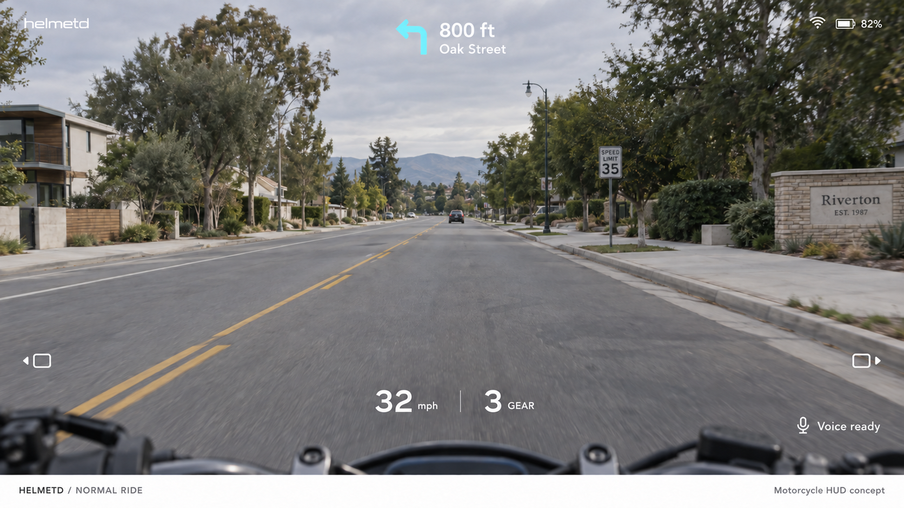
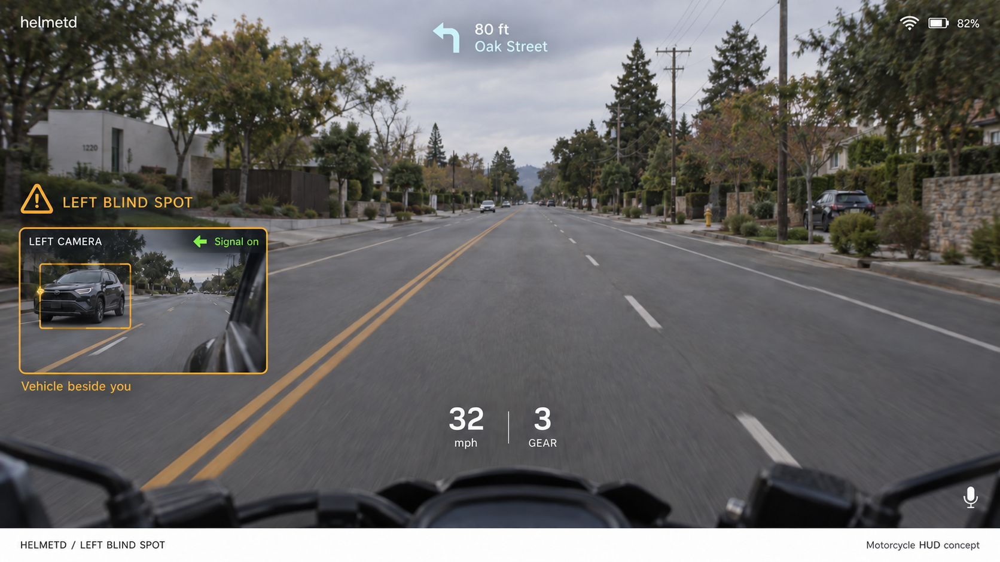
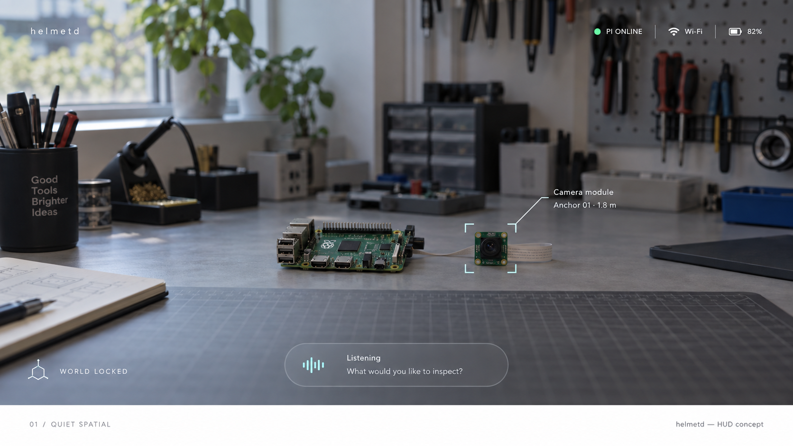
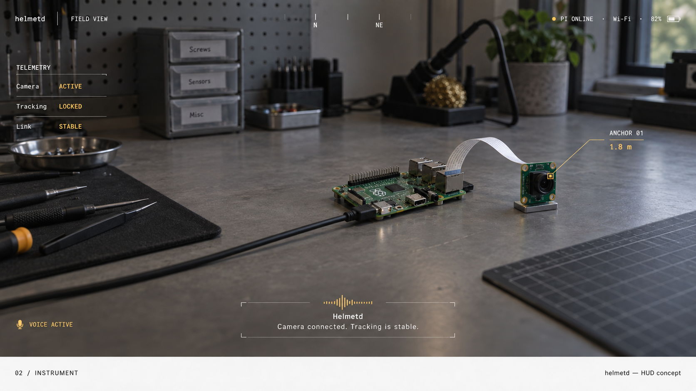

# HUD concepts

## Motorcycle feature direction

The user's feature list establishes a motorcycle awareness HUD: quiet by default,
with signal-driven camera views and prioritized warnings. See the
[feature brief and demo sequence](feature-brief.md).

These revised concepts were generated with built-in imagegen. Their exact
[prompts and corrections](motorcycle-prompts.json) are saved alongside them.

## Earlier style explorations

Two visual directions generated with built-in imagegen on 2026-10-03. These are
design mockups; status, battery, and distance values are illustrative. The workshop
is context for the overlay, not a proposed camera-video background for the glasses.
Actual display placement, readability, and world anchoring require hardware tests.

## 01 / Quiet Spatial

Minimal status along the top, one label attached to a physical object, and a
compact voice strip below. White and pale cyan keep the interface visually quiet.
This is the proposed starting point for the everyday HUD.

## 02 / Instrument

A narrow telemetry rail, orientation marks, an anchor callout, and a spoken-response
caption. Amber accents and monospaced labels make system state easier to scan.
This could become an optional diagnostics view using the same underlying HUD state.

## Implementation direction

- Keep the center open; reserve persistent information for the edges.
- Separate fixed status/voice elements from labels positioned by tracked anchors.
- Show listening, thinking, speaking, disconnected, and tracking-lost states explicitly.
- Treat mockup values as examples; real status must come from measured device state.
- Build the selected layout as renderer primitives and text, not a flattened PNG.
- Exclude the white presentation caption strip from the runtime HUD.

The exact generation prompts are stored in [prompts.json](prompts.json). Both
images are original generated concepts with no input reference images.
