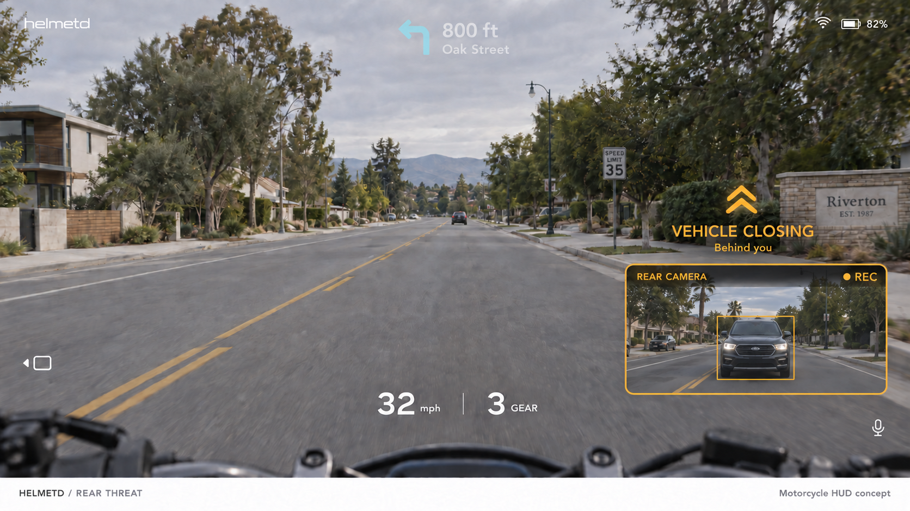
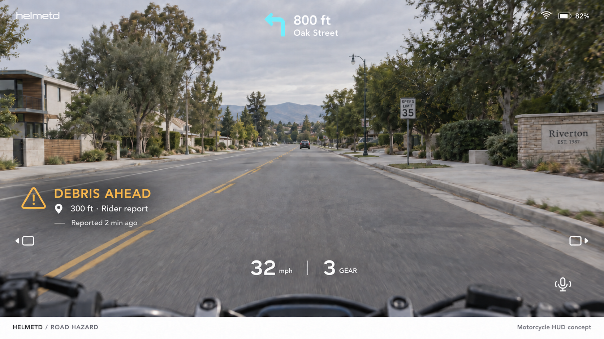
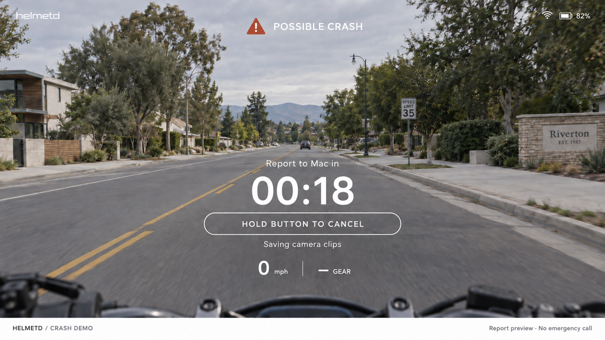
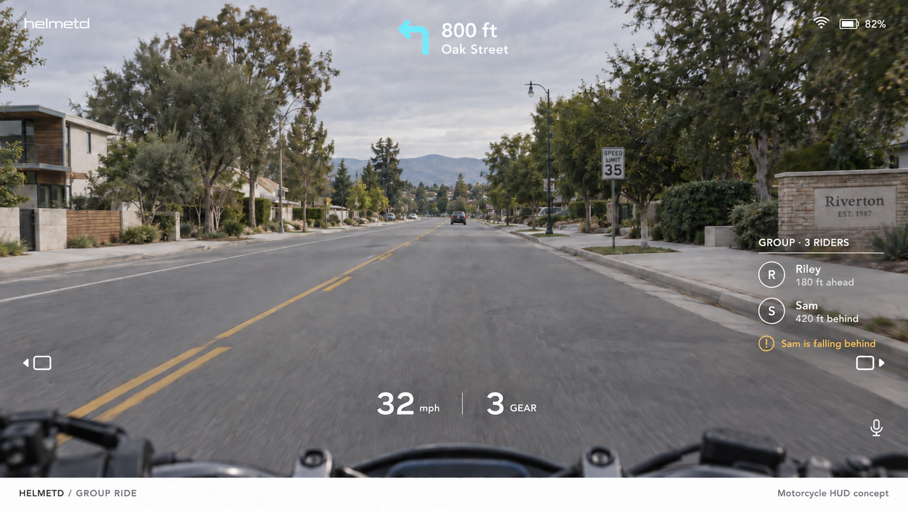

# Additional motorcycle HUD states

Four imagegen concepts extend the [normal and blind-spot views](README.md).
They share a reference image so navigation, speed, gear, and connection status
stay in familiar locations. All values, events, people, and reports are illustrative;
these images do not represent implemented detection or live sensor output.

## Rear threat

A directional warning opens a rear-camera inset while keeping the forward view
clear. The recording indicator distinguishes the incident recorder from video
loading. No distance, closing-speed, or collision-time number is shown without a
validated estimate. A failed or stale camera must show unavailable rather than
retain this illustrative live-looking image.

## Shared road hazard

The label names the hazard, approximate route distance, source, and report age.
It is a rider report, not a claim that a forward camera detected an object. The
warning is fixed in the HUD; it does not put an uncalibrated marker onto the road.
Report freshness, route relevance, confidence, and expiry need implementation.

## Possible crash countdown

A stationary demo state gives the countdown and cancellation action priority.
Its result is an incident report on the Mac, with no emergency call. The 18-second
display is a sample state, not a chosen detection threshold or timer specification.
Holding the physical button is a proposed cancellation mapping; input handling is
not implemented. Cancelling the report countdown should not delete captured clips.
The recording acknowledgement must reflect actual recorder state in the build.

## Group riding

A compact list shows two fellow riders; the group total includes the wearer.
Relative distances are sample location readouts, not image detections. A falling-
behind notice stays secondary to collision/hazard alerts. The implementation needs
timestamped locations, consent-based group membership, and an unavailable state
for stale positions rather than presenting old distances as current.

The separate [civic dashboard](../civic/README.md) holds aggregate maps and report
details. Generation prompts and the selected rear-camera text correction are
preserved in [feature-concepts-prompts.json](../feature-concepts-prompts.json).
The white footer is presentation framing and is excluded from the actual HUD.
