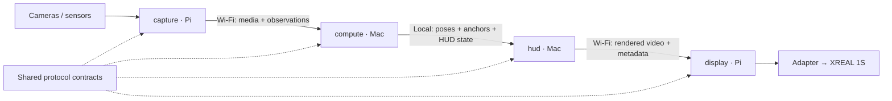

# Repository and project plan

Status: four native core project folders are scaffolded; the HUD test sender is
runnable. The Python voice app and shared LLM package are also implemented, with
offline tests and live account/audio configuration pending.

Shelby Ride is now imported in `apps/game` with its own npm lockfile. The
[game-driven demo plan](game-integration.md) covers simulated features and live
cameras; the game-to-HUD adapter is pending.

The [stack recommendation](stack.md) specifies C++20 core applications, native
media/rendering libraries, Protobuf contracts, and CMake builds.

## One repository, multiple projects

Use one Git repository, `helmetd`, with several runnable projects. A project is
a build/run boundary inside the repository; a computer is a deployment target.
The same computer can run more than one project.

The folders follow the component layout below. Capture, compute, and display
remain placeholders with documented responsibilities.

## Proposed core projects

| Project | Runs on | Owns | Produces |
| --- | --- | --- | --- |
| `apps/game` | Mac browser | Motorcycle simulation, traffic, road world; future scenario controls | Gameplay rendering; state export pending |
| `apps/capture` | Pi | Camera acquisition, sensor drivers, acquisition timestamps, uplink | Camera streams and sensor/pose observations |
| `apps/compute` | Mac | Input ingestion, tracking/fusion, world coordinates, physical anchors, application state | Timestamped poses, anchor updates, and HUD state |
| `apps/hud` | Mac | Scene presentation, calibrated eye views, HUD graphics, video encoding | Rendered video and matching frame metadata |
| `apps/display` | Pi | Downlink reception, decoding, presentation, stale-frame handling | HDMI output to the XREAL adapter |
| `apps/voice` | Mac | ElevenLabs conversation, standalone TTS, authenticated LLM bridge | Local speech, streamed agent responses |
| `packages/llm` | Mac | Provider selection and SDK adapters; shared by gateway and text CLI | Text deltas from OpenAI, Gemini, or Claude |

These are proposed project boundaries, not four network services. Capture and
display need separate launch paths for bench testing. Compute and HUD need a
clear interface so either can run with recorded or synthetic input. Their exact
process arrangement can remain simple and depend on the selected runtimes.



## Proposed layout

```text
helmetd/                       One Git repository
  apps/
    game/                      Shelby Ride browser game and asset sources
    capture/                   Camera/sensor application
    compute/                   Tracking and application state
    hud/                       Rendered graphics and output encoding
    display/                   Video receiver and glasses output
    voice/                     Python voice sidecar and LLM gateway
  packages/
    llm/                       Provider-independent Python reasoning interface
    protocol/
      schemas/                 Wire messages and local component contracts
      examples/                Small shared validation fixtures
  config/
    pi/                        Profiles for both Pi applications
    mac/                       Profiles for both Mac applications
  hardware/
    calibration/               Wiring, profiles, and calibration procedures
  tools/                       Replay, diagnostics, and benchmarks
  deploy/                      Add when the first runnable deployment exists
    pi/
    mac/
  docs/                        Architecture, decisions, and setup guides
```

Each application should gain its own source directory, dependency/build
manifest, README, configuration documentation, and relevant tests when it is
implemented. Use the selected ecosystem's workspace and lockfile conventions.
Applications may use different languages; a monorepo does not require one
package manager for every project.

## What is shared

Start with `packages/protocol`: message schemas, IDs, timing conventions,
coordinate conventions, calibration references, and example messages.

Add a code library only when two implemented projects need the same logic and
can actually consume it. Keep sensor drivers with capture, tracking algorithms
with compute, and rendering code with HUD until a concrete reuse need appears.
Avoid a generic `shared` or `utils` directory with unclear ownership.

`packages/llm` is an explicit shared boundary requested for interchangeable AI
providers. The voice gateway and standalone text CLI use it. Python packages are
managed by the root uv workspace; native targets keep the existing CMake build.

All four applications depend on the agreed contracts. They should not import
each other's private source. Use in-process calls, local IPC, or network
transport as appropriate to the deployment; do not route local Mac traffic over
Wi-Fi simply because the applications are separate projects.

## Additional projects to inventory

These are questions about scope, not committed directories:

| Possible project | Create it when |
| --- | --- |
| Operator dashboard | A separate interface is needed for configuration, live diagnostics, or sessions. |
| Phone controller | A phone needs its own application and interaction flow. |
| Microcontroller firmware | A separate MCU actually controls or samples hardware. |
| Replay tooling | Recorded-session replay starts in `tools/`; the riding simulator already lives in `apps/game`. |
| Model training | Custom datasets, training, and evaluation become part of the product. |
| Website / documentation site | A published site becomes an explicit deliverable. |

## Creation order

1. Inventory the projects and define each one's input, output, runtime target,
   and ownership. Resolve overlaps before selecting frameworks.
2. Scaffold the component folders alongside hardware notes, shared protocol,
   and device configuration. This step is complete for the four core projects.
3. Validate the recommended stack with the display and tracking experiments.
   Add real manifests as each project becomes runnable.
4. Define the first contracts and fixtures, including compute-to-HUD state.
5. Build `hud -> display` with a test pattern, then `capture -> compute` with
   timestamped input, then join the loop with one physical anchor.
6. Add root development commands for individual projects and the full loop.
   Add CI checks by project, plus consumer checks when shared contracts change.
7. Add deployment profiles per device. Build both device bundles from an
   identifiable commit and include compatible protocol versions in their
   handshake so a stale Pi deployment is detectable.

## When another Git repository would help

Use a separate repository if a component needs genuinely separate access,
ownership, licensing, or an independent public lifecycle. Different languages
or different deployment machines alone do not require separate repositories.
The current coupled pipeline benefits from changing producers, contracts, and
consumers together in one reviewed commit.
